# __Куликов Кирилл, 3 курс, К0109-23__

# SRE Workshop

## что я изучил перед работой

1) папку `PRACTIC` в репе препода и основной `PRACTIC/README.md` где описан полный sre workshop на 5 уроков
2) папку `Presentation` где лежат `K8s_Lecture_Presentation.pptx`, `Linux_Internals_Course.pptx`, `SRE_v2.pptx`

1) `Presentation/SRE_v2.pptx` для общей логики sre
2) `Presentation/Linux_Internals_Course.pptx` для понимания контейнерной базы
3) `Presentation/K8s_Lecture_Presentation.pptx` как мостик к следующей части курса


## главный контекст
> делаю все в контейнере

1) хост где стоит docker
2) внутри docker compose поднимаются сервисы workshop
3) все команды для практики через `docker-compose`

## структура отчета и скринов

все скрины здесь:

`Students/K0109-23/Kulikov/Practic/SRE/screens/`

и внизу каждого шага в readme скрин:

``

## мини план всех новых работ

1) урок 1 nginx и reverse proxy
2) урок 2 dockerfile и сборка контейнеров
3) урок 3 rate limit в middleware
4) урок 4 логи и наблюдаемость
5) урок 5 network debugging и security

## подготовка окружения в контейнерном формате

1) проверка docker и compose

```bash
docker --version
docker compose version
```

2) запуск стенда

```bash
docker compose up --build -d
```

3) проверка сервисов

```bash
docker compose ps
```

должны быть живые сервисы `postgres`, `app`, `rate-limiter`, `nginx`

4) быстрый smoke test

```bash
curl -v http://localhost/health
curl -v http://localhost/api/status
```

если прилетает `200` и json значит база рабочего состояния норм

## урок 1 nginx и reverse proxy

что делаем

1) nginx конфиг

```bash
cat PRACTIC/nginx.conf
```

2) логи nginx

```bash
docker compose logs -f nginx
```

3) синтаксис конфига

```bash
docker compose exec nginx nginx -t
```

4) reload без перезапуска

```bash
docker compose exec nginx nginx -s reload
```

что может пойти не так

1) `404` через `localhost` при том что `localhost:3000/health` живой
часто конфликтует дефолтный конфиг nginx в контейнере
фикс

```bash
docker compose exec nginx sh -lc 'rm -f /etc/nginx/conf.d/default.conf && nginx -s reload'
```

скрины: 

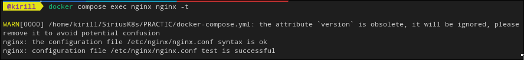
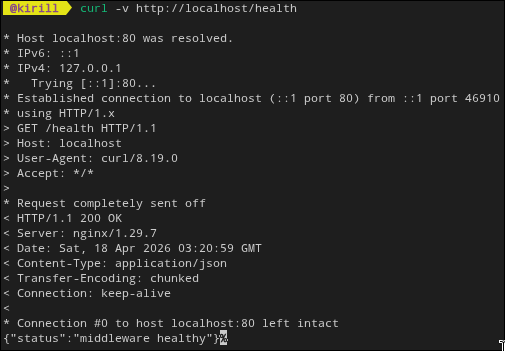

## урок 2 docker контейнеризация

что делаем

1) dockerfile app и middleware

```bash
cat PRACTIC/Dockerfile.app
cat PRACTIC/Dockerfile.middleware
```

2) слои и размер образов

```bash
docker images | rg sirius
docker history sirius_app:latest
```

3) что внутри app контейнера

```bash
docker compose exec app ls -lah /app
```

типичные проблемы и фиксы

1) checksum mismatch в go.sum

```bash
cd PRACTIC
rm -f go.sum
go mod tidy
cd ..
docker compose up --build -d
```

2) timeout при pull образов

```bash
docker pull golang:1.22-alpine
docker pull node:18-alpine
docker pull postgres:15-alpine
docker pull nginx:alpine
```

скрины:

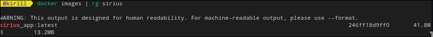
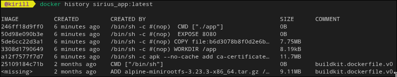
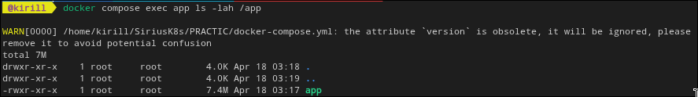
## урок 3 rate limiting

что делаем

1) прогон авто теста лимитов

```bash
cd PRACTIC
bash test-rate-limiting.sh
cd ..
```

2) ручная серия запросов

```bash
for i in {1..30}; do curl -s -o /dev/null -w "req $i status %{http_code}\n" http://localhost/api/status; done
```

ожидаю что часть ответов будет `429`

3) логи middleware

```bash
docker compose logs -f rate-limiter
```

скрины

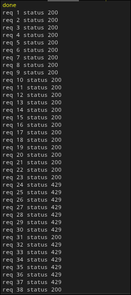
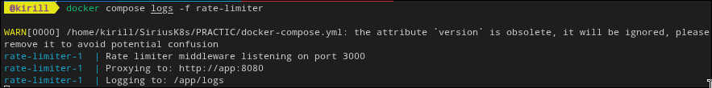
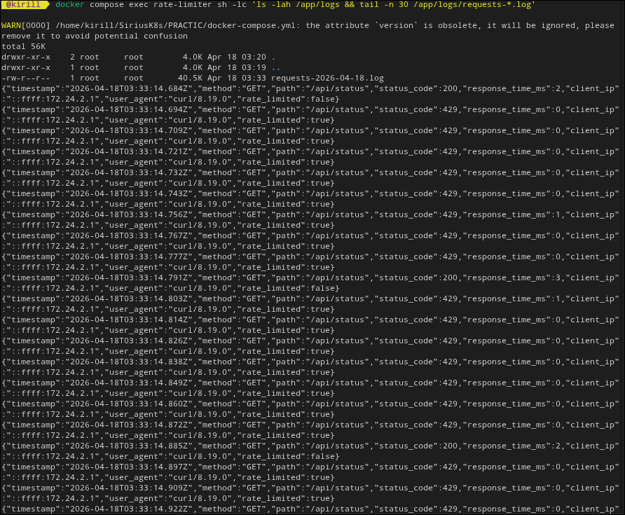

## урок 4 logging и observability

что делаем

1) file логи в middleware

```bash
docker compose exec rate-limiter sh -lc 'ls -lah /app/logs && tail -n 30 /app/logs/requests-*.log'
```

2) sql проверка логов в postgres

```bash
docker compose exec postgres psql -U demo -d demo -c "SELECT timestamp, method, path, status_code, response_time_ms, rate_limited FROM request_logs ORDER BY timestamp DESC LIMIT 15;"
```

3) метрики по статусам

```bash
docker compose exec postgres psql -U demo -d demo -c "SELECT status_code, COUNT(*) AS cnt, ROUND(AVG(response_time_ms)::numeric,2) AS avg_ms FROM request_logs GROUP BY status_code ORDER BY cnt DESC;"
```

скрины

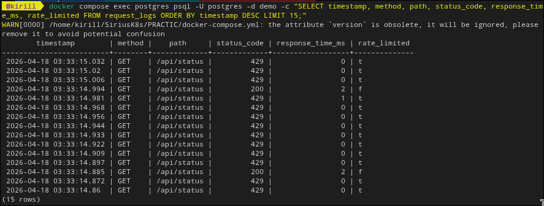
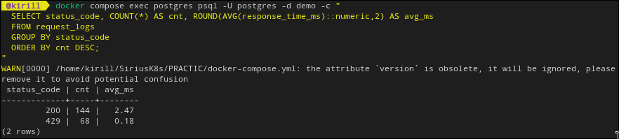


## урок 5 network debugging и security

что делаем

1) tcpdump между nginx и middleware

```bash
docker compose exec nginx tcpdump -i eth0 -A 'tcp port 3000'
```

в другой вкладке

```bash
curl -v http://localhost/api/status
```

2) api тесты

```bash
cd PRACTIC
bash test-api.sh
cd ..
```

3) security скан контейнеров

```bash
cd PRACTIC
chmod +x check-docker-security.sh
./check-docker-security.sh app postgres rate-limiter nginx
cd ..
```

скрины

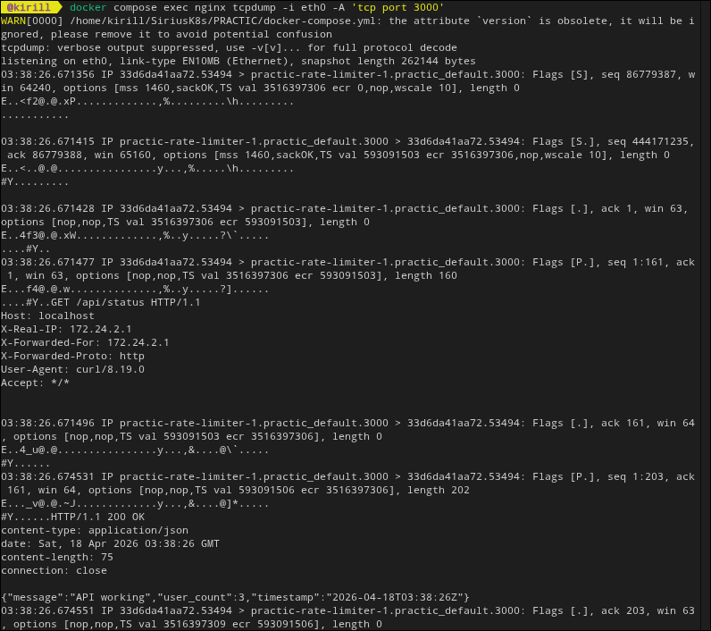
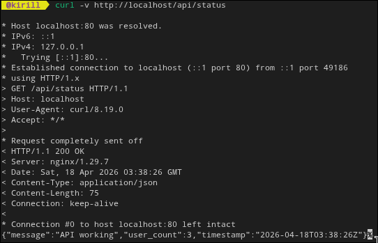
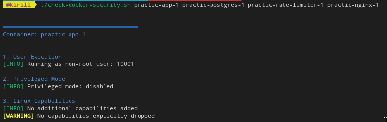


## intentional failure сценарии для отчета

### сценарий 1 ломаем базу

```bash
docker compose logs -f app
```

в другой вкладке

```bash
docker compose exec postgres bash < PRACTIC/break-db.sh
curl -v http://localhost/api/status
```

ожидаю `500`
после этого восстановление

```bash
docker compose restart postgres app
```

скрин

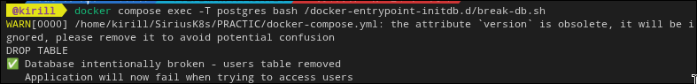


### сценарий 2 стоп приложения

```bash
docker compose stop app
curl -v http://localhost/api/status
```

ожидаю `502`
восстановление

```bash
docker compose start app
```

скрин
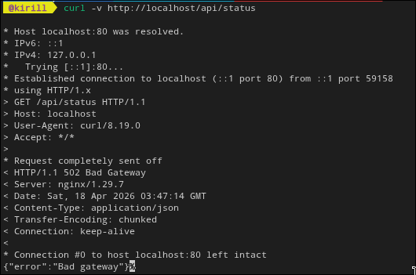

# на это все. работа выполнена в полном объеме