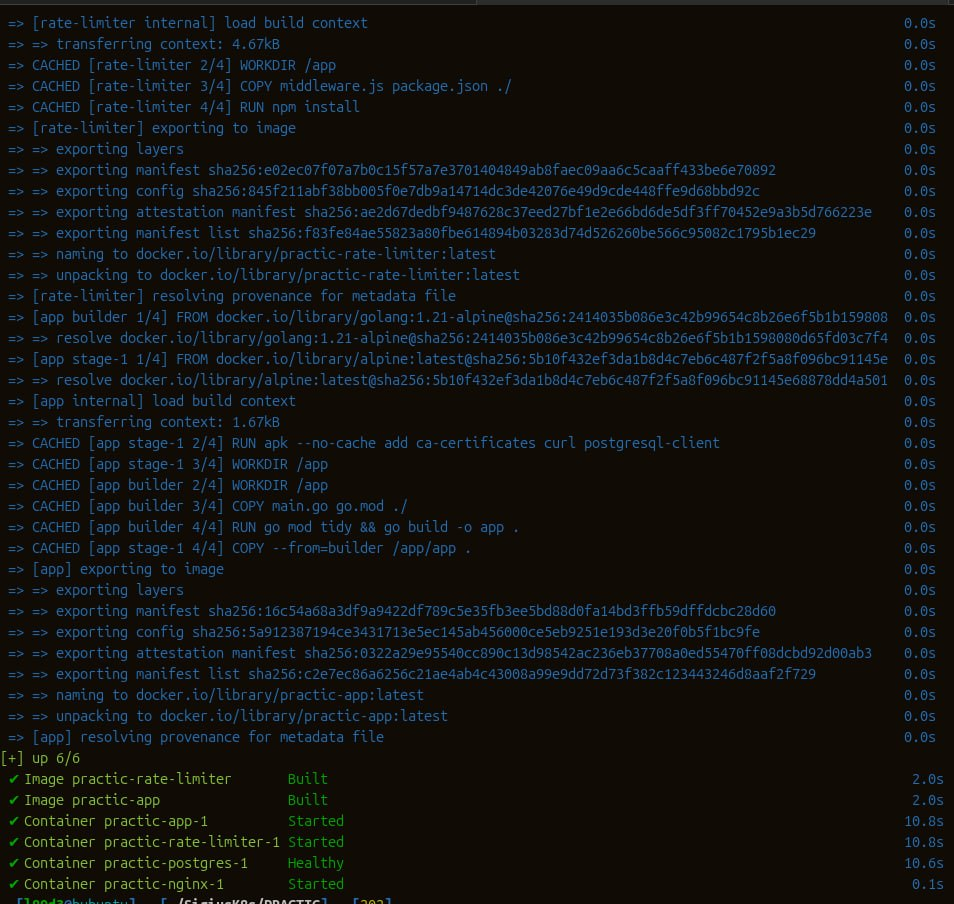
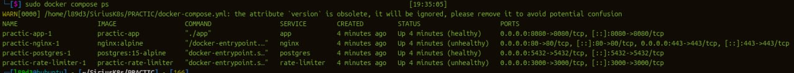
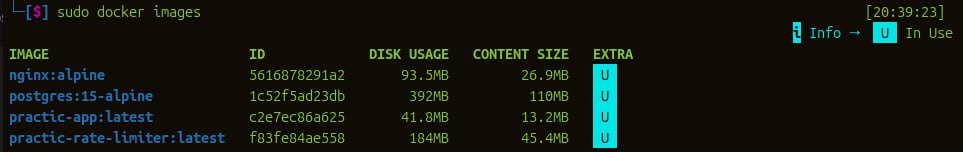
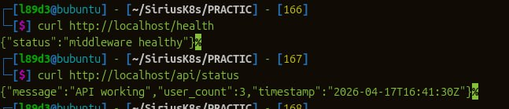
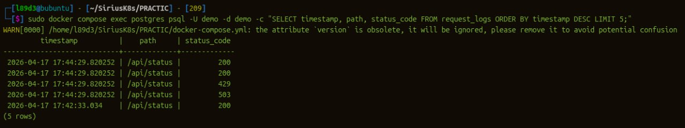
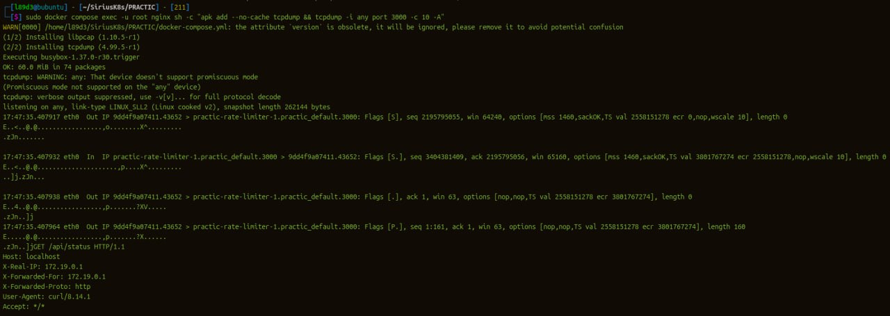
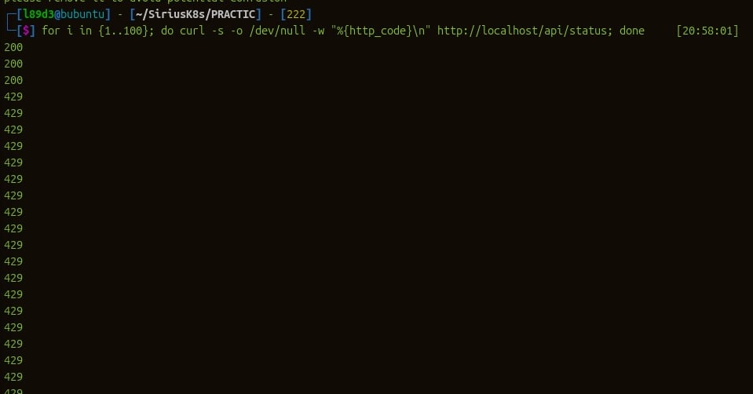
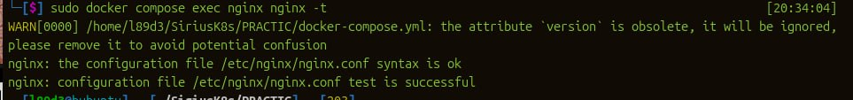
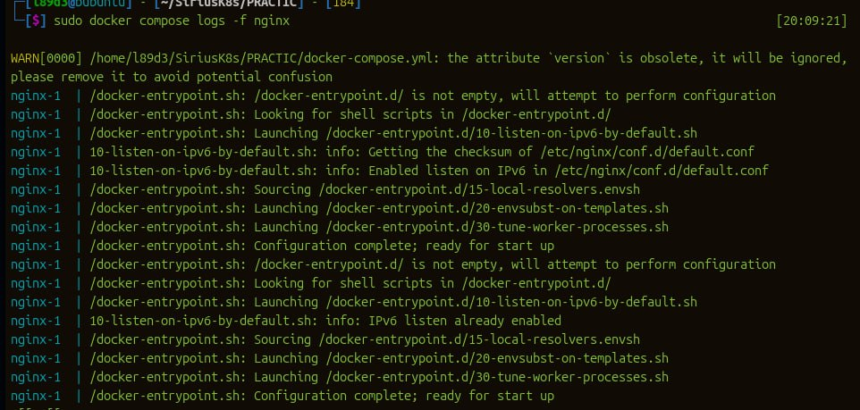
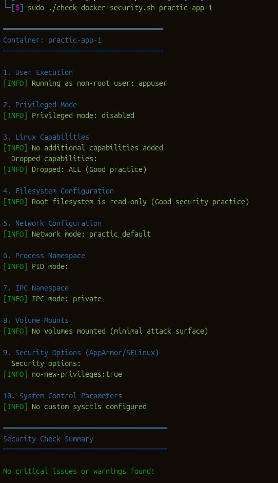

# Лабораторная работа: SRE и эксплуатация систем

В данной работе была проведена настройка и оптимизация Docker-инфраструктуры, сетевой анализ и укрепление безопасности контейнеров.

## # Урок 1-2: Оптимизация сборки и Docker
Настроила Dockerfile для стабильной сборки приложения. Главной проблемой было то, что зависимости не скачивались из-за сетевых ограничений.

Ошибки и исправления:
* Проблема: Ошибка таймаута при скачивании Go-модулей.
* Решение: Добавила в Dockerfile переменные GOPROXY и GOSUMDB=off для работы через зеркало.
* Результат: Использовала многоэтапную сборку (multi-stage), что позволило получить легкий и рабочий образ.

## # Урок 3: Работа с базой данных
Настроила связь приложения с PostgreSQL для записи логов.

Ошибки и исправления:
* Проблема: Ошибка 500 при подключении к базе (отсутствие нужной роли).
* Решение: Вручную создала роль demo внутри контейнера базы и настроила права доступа. Проверила запись логов через SQL-запрос.

## # Урок 4: Сетевой анализ (tcpdump)
Проверила передачу данных между Nginx и приложением внутри Docker-сети.

Что сделала:
* Установила tcpdump в контейнер Nginx и перехватила трафик на порту 3000.
* На скриншотах зафиксировала GET-запрос с заголовками Host и User-Agent, подтвердив правильность работы прокси.

## # Урок 5: Настройка Rate Limiting
Настроила защиту от перегрузки запросами.

Ошибки и исправления:
* Проблема: Nginx отдавал ошибку 503 при превышении лимитов.
* Решение: Исправила конфиг Nginx, добавив limit_req_status 429. Теперь сервер возвращает корректный код "Too Many Requests". Также урезала burst до 2 для ограничения кол-ва запросов не помню для чего-то там, еще меняла параметры задержки и вовсе убирала её для решения проблемы.

## # Урок 5 (финал): Безопасность (Hardening)
Провела полный аудит безопасности и устранила критические замечания сканера.

Ошибки и исправления:
* Проблема: Контейнер работал от root, а файловая система была доступна для записи.
* Решение: 
1. Создала пользователя appuser в Dockerfile и переключилась на него.
2. В docker-compose.yml включила read_only: true, cap_drop: ALL и запретила повышение привилегий.
* Результат: Система успешно прошла аудит без предупреждений и ошибок.

## # Вывод
В результате работы была создана отказоустойчивая и защищенная инфраструктура. Я научилась находить причины ошибок в сетевых пакетах, исправлять конфигурации прокси-серверов и настраивать безопасность контейнеров.